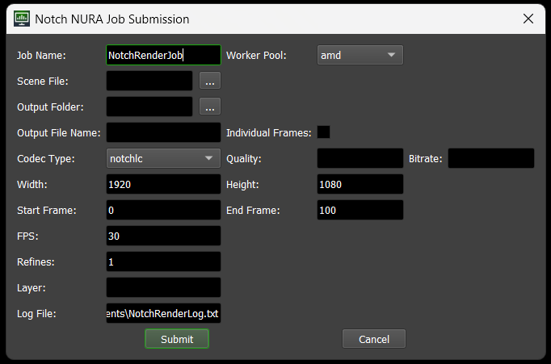
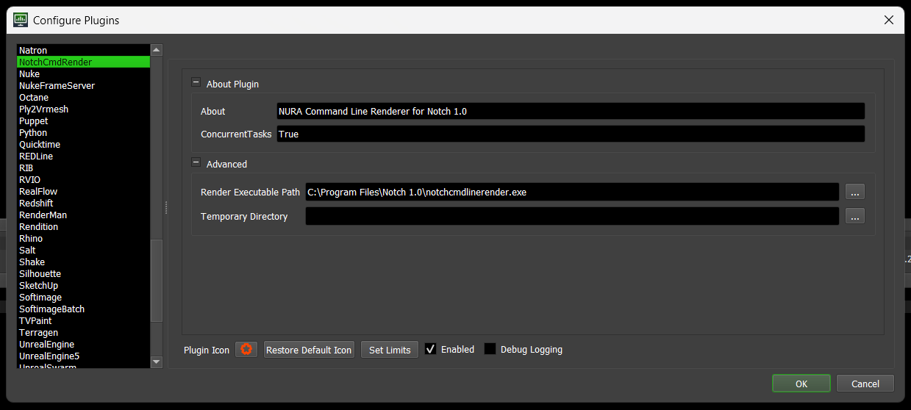
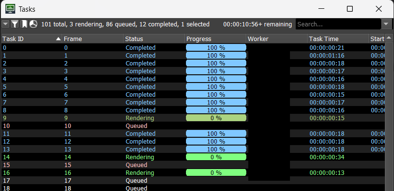

# Notch Render Node CLI Plugin for Deadline
A [Thinkbox Deadline](https://aws.amazon.com/thinkbox-deadline/) submission plugin for rendering Notch (.dfx) files using the Notch Render Node CLI.


## Features

- Support for Notch 2026.1 Render Node CLI
- Multiple output codec options (notchlc, h264, h265, hap, hapa, hapq, exr, png, jpeg, tga, tif)
- Frame range rendering with configurable chunk sizes
- Individual frame export support for image sequences and notchlc codec
- Real-time filename preview showing actual output format
- Resolution control (up to 16384x16384)
- Configurable quality and bitrate settings
- Custom layer rendering support
- Comprehensive path validation and sanitization
- Automatic file cleanup
- Windows UNC path support
- Detailed logging system



## Supported File Formats

### Input
- Notch Scene Files (.dfx)

### Output
- NotchLC Single Frame Sequences:
  - MOV (notchlc) with optional individual frame numbering
- Video Formats:
  - MOV (notchlc, hap, hapa, hapq codecs)
  - MP4 (h264, h265 codecs)
- Image Sequences:
  - EXR (.exr)
  - PNG (.png)
  - JPEG (.jpg, .jpeg)
  - TGA (.tga)
  - TIFF (.tif, .tiff)

## Requirements

- Windows operating system
- Notch 2026.1 or higher installed
- Codemeter 8.20a or higher installed
- A Notch VFX or RFX License (or a dedicated Render Node License)
- Deadline Repository and Client
- Valid render pool configuration in Deadline

## Installation

1. Copy the plugin files to your Deadline Repository:
```
  custom/
  ├─ plugins/
  │  └─ NotchCmdRender/
  │     ├─ NotchCmdRender.ico
  │     ├─ NotchCmdRender.param
  │     └─ NotchCmdRender.py
  └─ scripts/
     └─ Submission/
      ├─ icon.png
      └─ NotchCmdRenderSubmission.py
```

2. Ensure the Notch Render Node CLI (`NotchRenderNodeCLI.exe`) is installed in the default location or update the path in `NotchCmdRender.param`

## Configuration

The plugin can be configured through `NotchCmdRender.param`:

- `RenderExecutable`: Path to `NotchRenderNodeCLI.exe`
- `TempDir`: Optional custom temporary directory for intermediate files



## Usage

1. Launch Deadline Monitor
2. Click "Submit Job"
3. Select "Notch NURA Job Submission"
4. Fill in the required fields:
   - Job Name
   - Worker Pool
   - Scene File (.dfx)
   - Output Folder and Filename
   - Individual Frames option (for notchlc codec)
   - Codec Type
   - Resolution
   - Frame Range
   - FPS
   - Quality/Bitrate (optional)
   - Refines (optional)
   - Layer index or Layer Name (optional)
   - GPU (optional, for multi-GPU machines)
   - Colour Space (optional)
   - AOV buffer (optional)
   - Log File (optional)
5. Click "Submit" to send the job to Deadline



## Features in Detail

### Individual Frames Mode
- Automatically enabled for image codecs (exr, png, jpeg, tga, tif)
- Optional for notchlc codec (user-selectable)
- Disabled for other video codecs (h264, h265, hap, hapa, hapq)
- Appends frame numbers to filenames only when needed
- Sets chunk size to 1 for optimal distribution
- Real-time preview of resulting filename format

### Codec-Specific Behavior
- Image formats (exr, png, jpeg, tga, tif): Always use individual frames, `-still` flag passed automatically
- NotchLC (.mov): Optional individual frames with frame number appending
- Video formats (h264, h265, hap, hapa, hapq): Always single file output, no frame numbering

### Path Validation
- Checks for unsafe characters
- Prevents directory traversal
- Validates file extensions
- Handles UNC paths
- Enforces Windows path length limits

### Error Handling
- Validates all inputs before submission
- Provides detailed error messages
- Retries locked file operations
- Cleans up temporary files
- Logs all operations

### UI Improvements
- Interactive filename preview shows actual output format with/without frame numbers
- Codec selection automatically configures related options
- Logical control layout with related options grouped together
- Context-aware controls that enable/disable based on compatibility

## Support

For issues related to:
- Plugin functionality: Check Deadline Monitor logs
- Render errors: Check the specified log file or Notch render logs
- Configuration: Review NotchCmdRender.param settings
- For more information: https://manual.notch.one/2026.1/en/docs/reference/notchrendernodecli/

## License

This plugin is written by Antony Bailey with the permission of 10bit FX Ltd.
